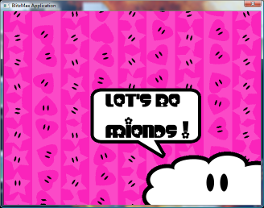
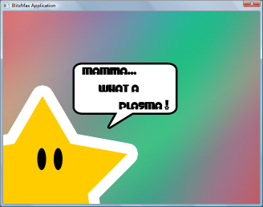
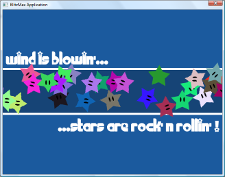
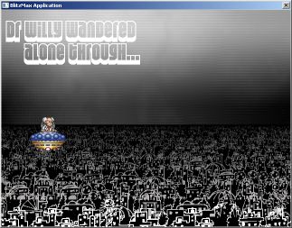

# visual-effects
Back in 2007/2008 I had some fun with BlitzMax, a programming language dedicated to games. I remember taking my super neat Asus U1-1P051E ultra-portable laptop with me in the parisian subway while commuting to the office and getting some Photoshop / coding work done in that crowded space.
# Hearts and stars

**Executable**: hearts_and_stars.exe (Windows, Linux with Wine)
# Plasma

# Rolling stars

# Willy through the city
